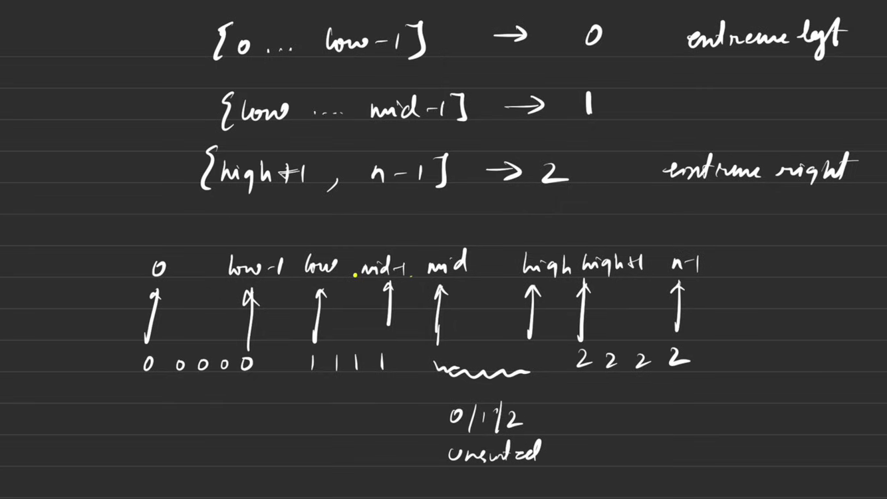

# Problem: Sort Colors
You are given an array nums containing n objects colored red, white, or blue. We will use the integers 0, 1, and 2 to represent the colors red, white, and blue, respectively.

Your task is to sort this array in-place so that all objects of the same color are adjacent, with the colors in the order red, white, and blue (0, 1, 2). You must solve this problem without using the library's sort function. This is often known as the Dutch National Flag problem.

Example: Input: nums = [2, 0, 2, 1, 1, 0] Output: [0, 0, 1, 1, 2, 2]

---
## 1st approch

````
count number of 0s,1s and 2s and put them again from starting of array
````

## optimal
 

  

````java
class Solution {
    public void swap(int i,int j,int[] nums){
        int temp=nums[i];
        nums[i]=nums[j];
        nums[j]=temp;
    }
    
    public void sortColors(int[] nums) {
        int n=nums.length;
        // Pointers to manage the boundaries of 0s, 1s, and 2s
        int low=0, mid=0, high=n-1;
        
        // Process the array until the mid pointer crosses the high pointer
        while(mid<=high){
            if(nums[mid]==0){
                // If the element is 0, swap it with the element at the low pointer
                swap(low,mid,nums);
                // Increment both low and mid pointers
                low++;
                mid++;
            }
            else if(nums[mid]==1){
                // If the element is 1, it's in the correct place, so just move the mid pointer
                mid++;
            }
            else //nums[mid]==2
            {
                // If the element is 2, swap it with the element at the high pointer
                swap(mid,high,nums);
                // Decrement the high pointer. Do not increment mid, as the new nums[mid] needs to be checked.
                high--;
            }
        }
        // Time Complexity: O(N) because it's a single pass through the array.
        // Space Complexity: O(1) as the sorting is done in-place.
    }
}

````


