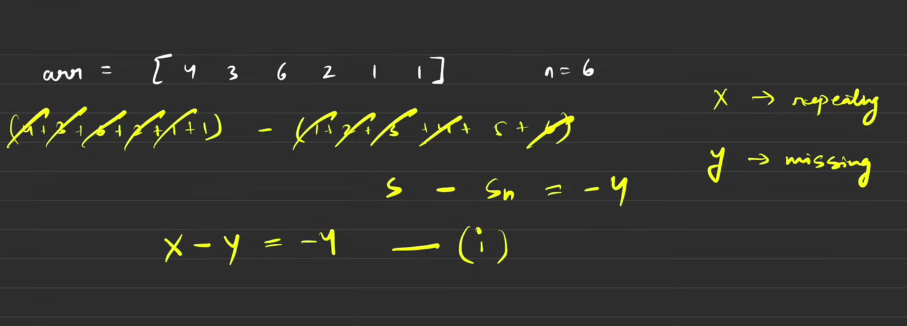
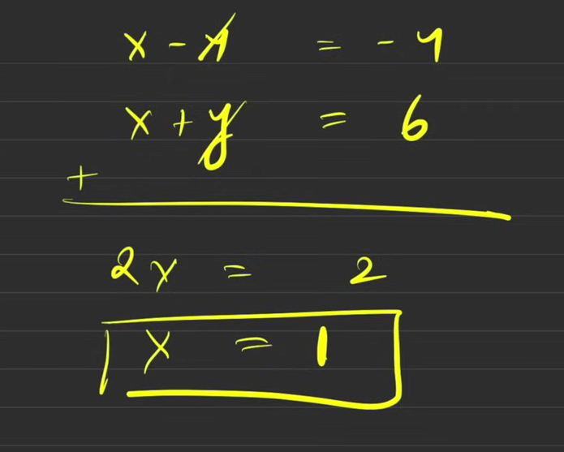

# Problem: Find Repeating and Missing Number
You are given a read-only array arr of size n. The array contains integers from 1 to n, but with a twist: exactly one number from 1 to n is missing, and exactly one number is repeated. Your task is to find and return both of these numbers.

Example: Input: arr = [3, 1, 2, 5, 3] Output: [3, 4] Explanation: The number 3 is repeated, and the number 4 (from the range [1, 5]) is missing

---
## using hashmap
````java
class Solution {
    /**
     * Finds the repeating and missing numbers in an array.
     * The array 'arr' of size 'n' contains numbers from 1 to n,
     * but one number is repeated and one number is missing.
     * @param arr The input array.
     * @return An ArrayList containing the repeating number at index 0
     * and the missing number at index 1.
     */
    ArrayList<Integer> findTwoElement(int arr[]) {
        // code here
        // HashMap to store the frequency of each number
        HashMap<Integer, Integer> map = new HashMap<>();
        int n = arr.length;
        
        // First pass: count frequencies of all elements
        for (int i = 0; i < n; i++) {
            map.put(arr[i], map.getOrDefault(arr[i], 0) + 1);
        }
        
        int rep = -1; // To store the repeating number
        int mis = -1; // To store the missing number
        
        // Second pass: check numbers from 1 to n
        for (int i = 1; i <= n; i++) {
            // If a number is in the map and its frequency is 2, it's the repeating one
            if (map.containsKey(i) && map.get(i) == 2) {
                rep = i;
            }
            // If a number from 1 to n is not in the map, it's the missing one
            if (!map.containsKey(i)) {
                mis = i;
            }
            
            // Optimization: break early if both are found
            if (rep != -1 && mis != -1) {
                break;
            }
        }
        
        // Add the repeating and missing numbers to the answer list
        ArrayList<Integer> ans = new ArrayList<>();
        ans.add(rep);
        ans.add(mis);
        return ans;
        
        // Time Complexity: O(N)
        // - The first loop to build the map is O(N).
        // - The second loop from 1 to n is also O(N).
        // - Total time is O(N) + O(N) = O(N). (Average case for HashMap operations)

        // Space Complexity: O(N)
        // - The HashMap can store up to N-1 unique elements in the worst case.
    }
}
````
## using Math



````java
class Solution {
    /**
     * Finds the repeating and missing numbers in an array using a mathematical approach.
     * The array 'arr' of size 'n' contains numbers from 1 to n,
     * but one number is repeated (let's call it 'R') and one is missing (let's call it 'M').
     * @param arr The input array.
     * @return An ArrayList containing the repeating number at index 0
     * and the missing number at index 1.
     */
    ArrayList<Integer> findTwoElement(int arr[]) {
        // code here
        int n = arr.length;
        long sum = 0;       // Will store the sum of all elements in arr (S)
        long sumSq = 0;     // Will store the sum of squares of all elements in arr (S_sq)
        
        // Calculate S and S_sq from the given array
        for (int i = 0; i < n; i++) {
            sum += (long)arr[i];
            sumSq += (long)arr[i] * (long)arr[i];
        }

        // Calculate the expected sum (Sn) and expected sum of squares (Sn_sq) for 1 to n
        long actSum = (long)n * (long)(n + 1) / 2;         // Sn = n*(n+1)/2
        long actSumSq = (long)n * (long)(n + 1) * (long)(2 * n + 1) / 6; // Sn_sq = n*(n+1)*(2n+1)/6
        
        // Let M = Missing, R = Repeating
        // 1. actSum - sum = M - R
        // We get this because S = Sn - M + R  =>  Sn - S = M - R
        long a = actSum - sum; // (M - R)
        
        // 2. actSumSq - sumSq = M^2 - R^2
        // We get this because S_sq = Sn_sq - M^2 + R^2  =>  Sn_sq - S_sq = M^2 - R^2
        // We know M^2 - R^2 = (M - R) * (M + R)
        // So, (M + R) = (M^2 - R^2) / (M - R)
        long b = (actSumSq - sumSq) / a; // (M + R)
        
        // Now we have two simple equations:
        // M - R = a
        // M + R = b
        
        // Add the two equations: 2*M = a + b  =>  M = (a + b) / 2
        long missing = (a + b) / 2;
        
        // Subtract the first from the second: 2*R = b - a  =>  R = (b - a) / 2
        long repeating = (b - a) / 2;
        
        ArrayList<Integer> ans = new ArrayList<>();
        ans.add((int)repeating);
        ans.add((int)missing);
        return ans;
        
        // Time Complexity: O(N)
        // - We iterate through the array once to calculate 'sum' and 'sumSq'.
        
        // Space Complexity: O(1)
        // - We only use a few constant-space variables to store the sums.
    }
}

````

