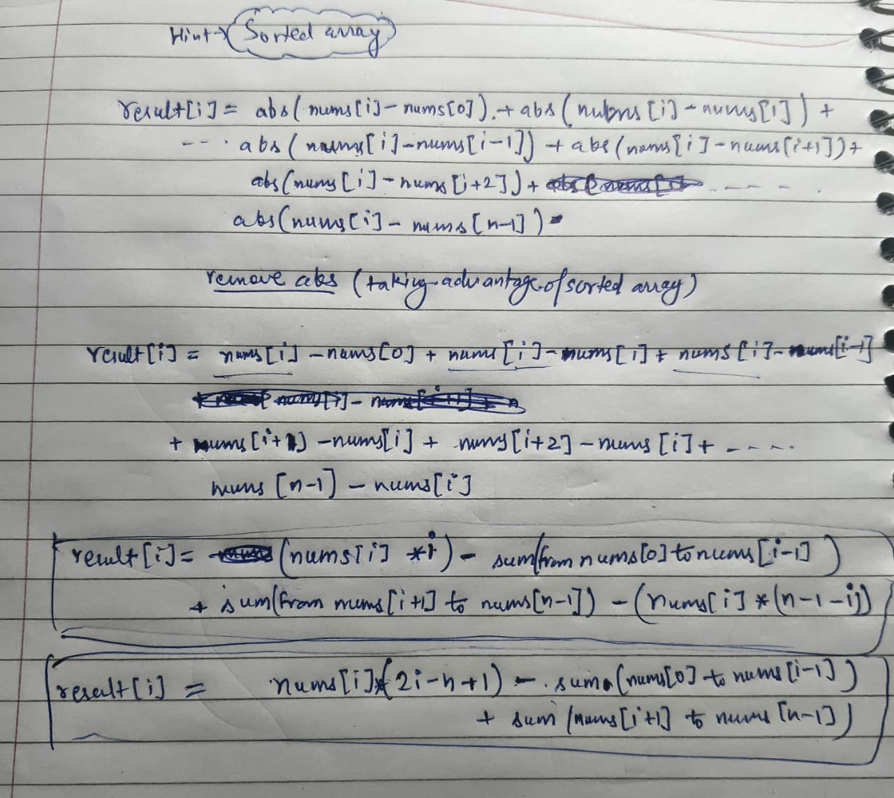

# sum of absolute difference in a sorted array


## O(n) time + O(n) space
````java
class Solution {
    public int[] getSumAbsoluteDifferences(int[] nums) {
        int n=nums.length;
        int[] prefixSum=new int[n];
        prefixSum[0]=nums[0];
        for(int i=1;i<n;i++){
            prefixSum[i]=prefixSum[i-1]+nums[i];
        }

        int[] ans=new int[n];
        for(int i=0;i<n;i++){
            if(i!=0)
            ans[i] = nums[i]*(2*i -n +1) 
                    - prefixSum[i-1]
                    +(prefixSum[n-1]-prefixSum[i]);
           
           else {
            ans[i] = nums[i]*(2*i -n +1) 
                    - 0
                    +(prefixSum[n-1]-prefixSum[i]);
           }
        }
        return ans;
    }
}
````
## O(n) time + O(1) space
````java
class Solution {
    public int[] getSumAbsoluteDifferences(int[] nums) {
        int n=nums.length;
       int totalSum=0;
        for(int i=0;i<n;i++){
            totalSum+=nums[i];
        }
        int prevSum=0;
        int[] ans=new int[n];
        for(int i=0;i<n;i++){
            
            ans[i] = nums[i]*(2*i -n +1) 
                    - prevSum
                    +(totalSum-(prevSum+nums[i]));
           
          
           prevSum+=nums[i];
        }
        return ans;
    }
}
````

