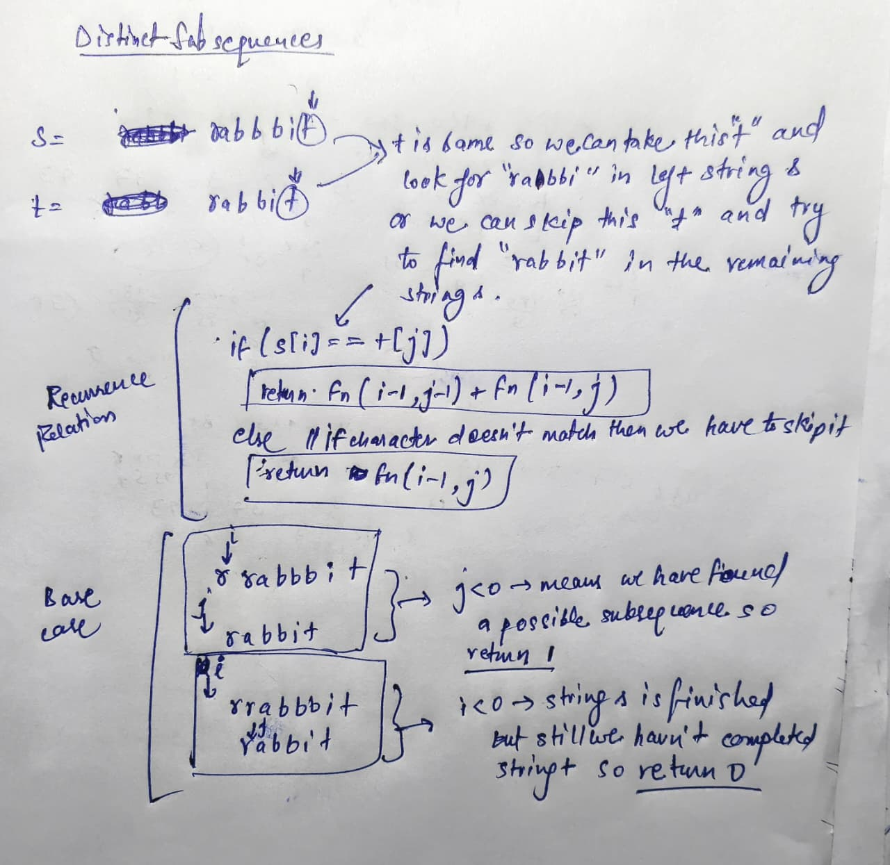

# Problem: Distinct Subsequences(leetcode)
Given two strings, s and t, your task is to count the number of distinct subsequences of s which are equal to t. A subsequence is formed by deleting some (or none) of the characters from the original string without changing the relative order of the remaining characters.

Example:

Input: s = "rabbbit", t = "rabbit"

Output: 3

Explanation: There are three ways to generate "rabbit" from "rabbbit":

ra**b**bbit

rab**b**bit

rabb**b**it

---


## memoization
````java
class Solution {
    // helper(i, j, ...) counts distinct subsequences of s[0..i] that equal t[0..j].
    public int helper(int i, int j, String s, String t, int[][] dp) {
        // Base case 1: If we've successfully matched all of t, we've found one way.
        if (j < 0) return 1;
        // Base case 2: If we've run out of s but not t, it's impossible.
        if (i < 0) return 0;
        
        // Return the cached result if available.
        if (dp[i][j] != -1) return dp[i][j];

        // If the characters match, we have two possibilities.
        if (s.charAt(i) == t.charAt(j)) {
            // 1. Match these characters: count ways from the rest of the strings (s[0..i-1], t[0..j-1]).
            // 2. Don't match s[i]: count ways from s[0..i-1] to form the same t[0..j].
            return dp[i][j] = helper(i - 1, j - 1, s, t, dp) + helper(i - 1, j, s, t, dp);
        }
        // If characters don't match, we must skip s[i].
        else {
            // The number of ways is whatever we can find in the rest of s.
            return dp[i][j] = helper(i - 1, j, s, t, dp);
        }
    }

    public int numDistinct(String s, String t) {
        int n1 = s.length();
        int n2 = t.length();
        int[][] dp = new int[n1][n2];
        for (int i = 0; i < n1; i++) Arrays.fill(dp[i], -1);
        
        // Start recursion from the end of both strings.
        return helper(n1 - 1, n2 - 1, s, t, dp);
    }

    // Time Complexity: O(N * M)
    // - Where N and M are the lengths of s and t respectively.
    // - Each state (i, j) is computed once due to memoization.

    // Space Complexity: O(N * M)
    // - For the DP table and the recursion stack.
}
````

## tabulation
````java
class Solution {
    public int numDistinct(String s, String t) {
        int n1=s.length();
        int n2=t.length();
    
       int[][] dp=new int[n1+1][n2+1];
       for(int i=0;i<n1+1;i++){
        for(int j=0;j<n2+1;j++){
            if(j==0) dp[i][j]=1;
            else if(i==0) dp[i][j]=0;
            else if(s.charAt(i-1)==t.charAt(j-1))
                dp[i][j]=dp[i-1][j-1]+dp[i-1][j];
            else 
                 dp[i][j]=dp[i-1][j];
                
            
        }
       }
       return dp[n1][n2];

    }
}
````
