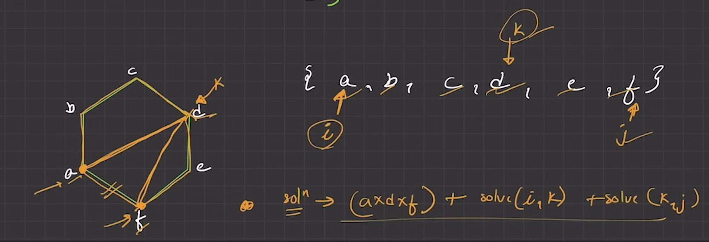

# Problem: Minimum Score Triangulation of Polygon
You are given n vertices of a convex polygon in a counter-clockwise order, with each vertex having a value values[i]. Your task is to triangulate the polygon into n-2 triangles. The score of a triangle formed by vertices i, j, and k is values[i] * values[j] * values[k]. You need to find the minimum total score of all triangles in the triangulation.

Example:

Input: values = [1, 2, 3]

Output: 6

Explanation: The polygon is a triangle. There is only one triangulation, which is the triangle itself. The score is 1 * 2 * 3 = 6.

Example 2:

Input: values = [3, 7, 4, 5]

Output: 144

Explanation: Two possible triangulations:

(3,7,4) + (3,4,5) = (3*7*4) + (3*4*5) = 84 + 60 = 144

(3,7,5) + (7,4,5) = (3*7*5) + (7*4*5) = 105 + 140 = 245 The minimum is 144.

---

## memoization+recursion
````java
class Solution {
    // helper(i, j, ...) finds the min score to triangulate the polygon
    // formed by the edge (i, j) and all vertices between them.
    public int helper(int i, int j, int[] values, int[][] dp) {
        // Base case: If there are fewer than 3 vertices, no triangle can be formed.
        if (j - i < 2) return 0;
        
        // Return the cached result if available.
        if (dp[i][j] != -1) return dp[i][j];

        int min = Integer.MAX_VALUE;
        // Try every vertex 'k' between 'i' and 'j' as the third vertex of a triangle.
        for (int k = i + 1; k < j; k++) {
            // The score is the cost of the triangle (i, k, j)
            // plus the cost of triangulating the two remaining smaller polygons.
            int weight = values[i] * values[j] * values[k]
                         + helper(i, k, values, dp)   // Cost of polygon (i...k)
                         + helper(k, j, values, dp);  // Cost of polygon (k...j)
            min = Math.min(weight, min);
        }
        
        // Cache and return the minimum score.
        return dp[i][j] = min;
    }

    public int minScoreTriangulation(int[] values) {
        int n = values.length;
        // dp[i][j] stores the min score for the polygon segment (i...j).
        int[][] dp = new int[n][n];
        for (int i = 0; i < n; i++) Arrays.fill(dp[i], -1);
        
        // Find the min score for the entire polygon (vertices 0 to n-1).
        return helper(0, n - 1, values, dp);
    }

    // Time Complexity: O(N^3)
    // - Where N is the number of vertices.
    // - There are O(N^2) states, and each state takes O(N) to compute (the k-loop).

    // Space Complexity: O(N^2)
    // - For the DP table and the O(N) recursion stack.
}
````
