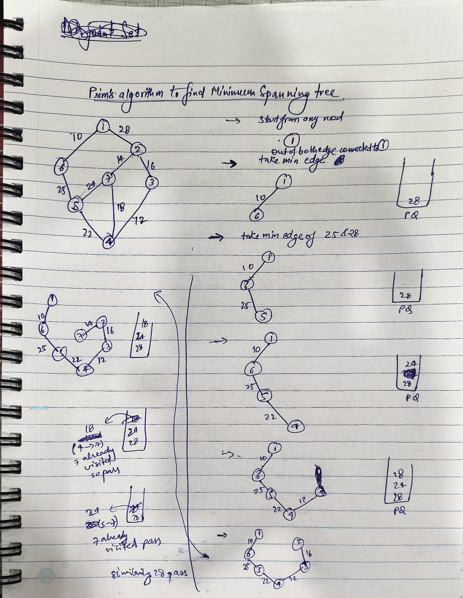

<span style="color:orange">**Problem:** Find the Minimum Spanning Tree (MST) of an undirected weighted graph using **Prim’s Algorithm** — return the edges that make up the MST.</span>

---


## Intuition
- **Goal:** Connect all vertices with minimum total edge weight and no cycles.
- **Prim’s Algorithm:** Start with any node, grow the MST by **always adding the smallest weight edge** that connects a visited node to an unvisited node.
- **Why it works:** Greedy approach using the **cut property** — the smallest edge crossing any cut must be in the MST.
- **Data structure:** A min-heap (priority queue) stores edges by weight.
- **Key difference vs Kruskal:**
    - Kruskal builds MST by sorting *all edges globally*.
    - Prim expands *from a node outward*, like Dijkstra but for MST.

---

## Implementation (Java)

```java
class Pair {
    int first, second;
    Pair(int first, int second) {
        this.first = first;
        this.second = second;
    }
}

class Tuple {
    int first, second, third; // parent, node, edge weight
    Tuple(int first, int second, int third) {
        this.first = first;
        this.second = second;
        this.third = third;
    }
}

class Solution {
    public List<List<Integer>> spanningTree(int V, int[][] edges) {
        // Step 1: Build adjacency list
        List<List<Pair>> adj = new ArrayList<>();
        for (int i = 0; i < V; i++) adj.add(new ArrayList<>());
        for (int[] e : edges) {
            int u = e[0], v = e[1], w = e[2];
            adj.get(u).add(new Pair(w, v));
            adj.get(v).add(new Pair(w, u));
        }

        // Step 2: Prim's algorithm using min-heap
        int[] vis = new int[V];
        PriorityQueue<Tuple> pq = new PriorityQueue<>((a, b) -> a.third - b.third);
        List<List<Integer>> ans = new ArrayList<>();

        pq.add(new Tuple(-1, 0, 0)); // parent,node,edge weight from parent to node

        while (!pq.isEmpty()) {
            Tuple t = pq.poll();
            int p = t.first, u = t.second, w = t.third;

            if (vis[u] == 1) continue;
            vis[u] = 1;

            // If not starting node, add edge to MST
            if (p != -1) {
                List<Integer> edge = new ArrayList<>();
                edge.add(p);
                edge.add(u);
                edge.add(w);
                ans.add(edge);
            }

            // Add adjacent edges to heap
            for (Pair it : adj.get(u)) {
                int v = it.second, edgeWeight = it.first;
                if (vis[v] == 0) pq.add(new Tuple(u, v, edgeWeight));
            }
        }

        return ans;
    }
}
```
## complexities
 ### time complexity
-  O(E logE)
### space complexity
-  O(E+V) ,  E+V for adj list ,E for priority queue
## Key Notes

- Works on connected, undirected graphs.

- If the graph is disconnected, Prim’s builds a Minimum Spanning Forest.

- Can start from any vertex — MST weight will be same.

- Better than Kruskal on dense graphs (when E ≈ V^2)
