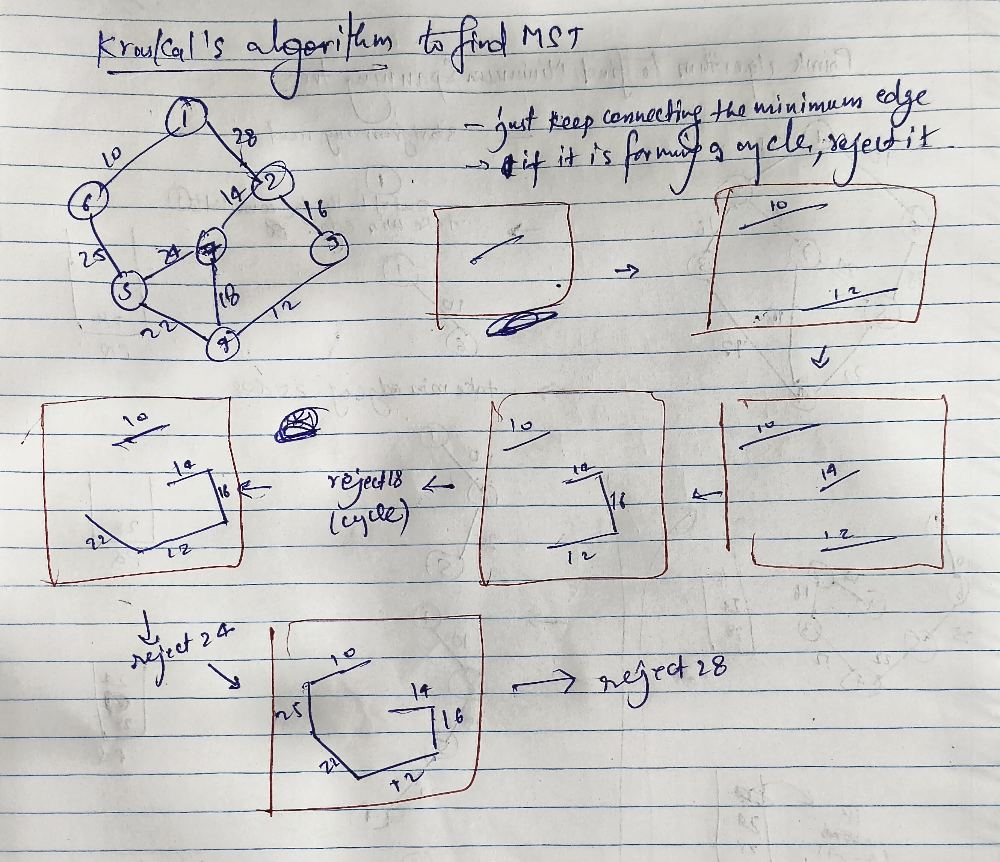

# Minimum Spanning Tree (MST) using Disjoint Set (Kruskal's algorithm)

---



1. **Sort the edges by weight (smallest first)**
    - Because in MST, we always pick the lightest edge available that does not form a cycle.

2. **Take each edge one by one (in sorted order)**
    - For every edge `(u, v, w)`:
        - If **both nodes are in different components**, include this edge in MST.  
          (Do a union so they become part of the same component.)
        - If **both nodes are already in the same component**, skip it.  
          (Because adding it would create a cycle, and MST must stay acyclic.)

3. **Keep adding the weight of valid edges to the MST sum**
    - At the end, this sum is the weight of the Minimum Spanning Tree.

---
```` java code
//copy class of disjoint set 
class Solution {
    public int spanningTree(int V, int[][] edges) {
        // Step 1: Sort all edges based on weight
        Arrays.sort(edges, (a, b) ->a[2] - b[2]);

        // Step 2: Initialize Disjoint Set
        DisjointSet ds = new DisjointSet(V);
        int ans = 0;

        // Step 3: Take edges one by one
        for (int[] it : edges) {
            int u = it[0];
            int v = it[1];
            int w = it[2];

            // Only take the edge if it connects different components
            if (ds.ulpar(u) != ds.ulpar(v)) {
                ans += w;                // add weight to MST sum
                ds.unionBySize(u, v);    // merge both components
            }
            // If already same component → skip (cycle would form)
        }
        return ans; // Final MST weight
    }
}
````
## time complexity- O(4 α)
