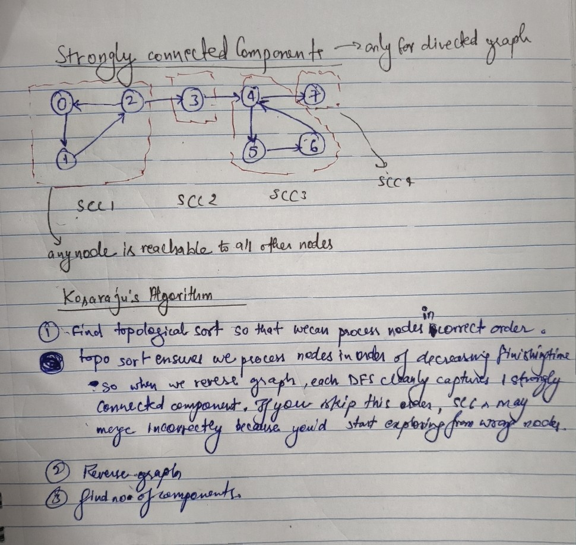

## Finding Number of Strongly Connected Components (Kosaraju's Algorithm)

**Problem Description:**  
Given a directed graph, determine how many strongly connected components (SCCs) it contains.  
A strongly connected component is a maximal set of nodes such that every node is reachable from every other node in the same set.



**Code:**
```java
class Solution {
    // DFS used to fill stack with finishing order
    private void dfs(int node, ArrayList<ArrayList<Integer>> adj, int[] vis, Stack<Integer> st) {
        vis[node] = 1;
        for(int nbr : adj.get(node)) {
            if(vis[nbr] == 0) {
                dfs(nbr, adj, vis, st);
            }
        }
        st.add(node);
    }

    // Simple DFS for SCC counting
    private void dfs(int node, ArrayList<ArrayList<Integer>> adj, int[] vis) {
        vis[node] = 1;
        for(int nbr : adj.get(node)) {
            if(vis[nbr] == 0) {
                dfs(nbr, adj, vis);
            }
        }
    }

    // Function to find number of strongly connected components
    public int kosaraju(ArrayList<ArrayList<Integer>> adj) {
        int n = adj.size();
        int[] vis = new int[n];
        Stack<Integer> st = new Stack<>();

        // Step 1: Order nodes by finish time
        for(int i = 0; i < n; i++) {
            if(vis[i] == 0) {
                dfs(i, adj, vis, st);
            }
        }

        // Step 2: Transpose the graph
        ArrayList<ArrayList<Integer>> adjT = new ArrayList<>();
        for(int i = 0; i < n; i++) adjT.add(new ArrayList<>());
        for(int u = 0; u < n; u++) {
            for(int v : adj.get(u)) {
                adjT.get(v).add(u);
            }
        }

        // Step 3: DFS on transposed graph in reverse finish order
        Arrays.fill(vis, 0);
        int count = 0;
        while(!st.isEmpty()) {
            int node = st.pop();
            if(vis[node] == 0) {
                dfs(node, adjT, vis);
                count++;
            }
        }
        return count;
    }
}
```
Time Complexity: O(V + E)  
DFS twice over all vertices and edges plus edge reversal.

Space Complexity: O(V + E)  
For adjacency list, visited array, and recursion stack.